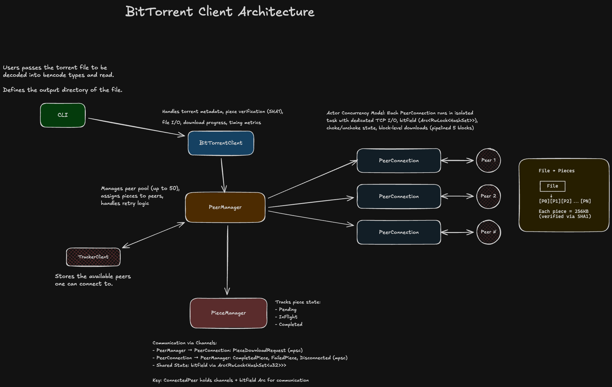

# BitTorrent Client (Rust)

BitTorrent client implementation in Rust, built from scratch to explore distributed systems, network protocols, and concurrent programming.

This project uses an **actor concurrency model** with **event-driven communication** through channels, enabling true parallelism while naturally preventing shared mutable state issues.

## Features

- Parse .torrent files using custom Bencode decoder
- **Magnet link support** with metadata fetching via Extension Protocol (BEP 9) - see [docs/MAGNET_LINKS.md](docs/MAGNET_LINKS.md)
- **DHT support** for trackerless peer discovery (BEP 5)
- Connect to tracker servers and discover peers
- Download files from multiple peers concurrently (up to 20 peers by default)
- Block pipelining: 5 concurrent block requests per peer for optimal throughput
- Verify downloaded pieces with SHA1 hashing
- Automatic retry logic for failed pieces with unlimited retries
- Graceful shutdown with proper piece requeuing on peer disconnect
- **Real-time multi-line terminal UI** with live progress updates every 2 seconds

## Quick Start

### Run Sample Download

```bash
make sample-run-1
```

### Build and Install Binary

In MacOS:
```bash
make install
```

This installs the binary as `bittorrent` in `~/.local/bin/`. Make sure `~/.local/bin` is in your PATH.

### Usage

```bash
bittorrent -i <torrent-file-or-magnet-link> -o <output-directory> [options]

Options:
  -i, --input <FILE|MAGNET>       Path to .torrent file or magnet link
  -o, --output <DIR>              Output directory for downloaded file
  --name <NAME>                   Output filename (for magnet links without display name)
  --max-download-rate <RATE>      Max download rate (e.g., 2M, 500K)
  --max-upload-rate <RATE>        Max upload rate (e.g., 100K, 1M)
  --max-peers <NUM>               Maximum concurrent peers (default: 20)
  --no-tracker                    Disable HTTP tracker (DHT only)
  --no-dht                        Disable DHT (tracker only)
  --log-dir <DIR>                 Directory to store log files
                                  (default: ~/Library/Logs/bittorrent on macOS, ./logs elsewhere)
```

Examples:
```bash
# Download from .torrent file
bittorrent -i ./tests/testdata/ubuntu-24.04.3-desktop-amd64.iso.torrent -o ~/Downloads --max-download-rate 2M --max-peers 15

# Download from magnet link
bittorrent -i "magnet:?xt=urn:btih:1e873cd33f55737aaaefc0c282c428593c16e106&dn=archlinux-2026.01.01-x86_64.iso" -o ~/Downloads
```

### Example Output

The terminal UI clears the screen and displays a real-time multi-line progress view:

```
Peers:     11 connected | 24 available (24 tracker, 0 DHT) | 0 choking
Pieces:    342/24208 (1%) | 23842 pending | 24 downloading
Bandwidth: ↓ 2.8 MB/s | ↑ 51 KB/s
DHT:       18 nodes | 5 buckets (1 full) | 18 IPv4, 0 IPv6
```

The display updates every 2 seconds, showing:
- **Peers**: Connected peers, available peers (breakdown by source), choking peers
- **Pieces**: Progress, pending/downloading counts
- **Bandwidth**: Real-time download/upload speeds
- **DHT**: Routing table statistics (nodes, buckets, IPv4/IPv6)

Watch as pieces flow in from multiple peers across the internet and reassemble into a verified file!

## Architecture Overview


## Technical Details

### Protocol & Networking
- **Protocol**: BitTorrent peer wire protocol over TCP with handshake, bitfield, interested, unchoke, request, and piece messages
- **Extension Protocol**: BEP 9 (metadata exchange) and BEP 10 (extension protocol) for magnet link support
- **DHT**: BEP 5 implementation for trackerless peer discovery with Kademlia routing table
- **Async Runtime**: Tokio-based with split read/write tasks communicating via `mpsc` channels
- **Piece Validation**: SHA1 hashing of downloaded pieces (20 bytes per hash)
- **Block Size**: 16 KiB per network request (as per BitTorrent spec)

### Concurrency Architecture
- **Peer Pool**: Up to 20 concurrent peer connections by default for maximum parallelism
- **Block Pipelining**: 5 concurrent block requests per peer to keep TCP pipeline full
- **Piece Limiting**: 1 concurrent piece download per peer to ensure stability
- **Task Model**: Background tasks for peer connection, piece assignment, completion handling, failure retry, disconnect handling, tracker refresh, and progress reporting
- **Graceful Shutdown**: All background tasks listen on broadcast channel and terminate cleanly

### Download Strategy
- **Piece Assignment**: Eager assignment to all available peers for maximum parallelism
- **Peer Selection**: Least-busy algorithm based on bitfield availability and active download count
- **Retry Logic**: Unlimited retries for failed pieces, exponential backoff for handshakes
- **Disconnect Handling**: Failed pieces are automatically requeued when peers disconnect

### Performance Characteristics
- **Theoretical Max Concurrency**: 20 peers downloading in parallel (configurable)
- **Network Efficiency**: Block pipelining (5 blocks ahead) keeps TCP pipeline full
- **Latency Optimization**: Pipelined requests reduce round-trip wait time
- **Backpressure**: Channel-based communication provides natural backpressure
- **Stability**: Single piece per peer prevents overwhelming individual connections

### Tests
Run tests:
```bash
cargo test              # Run all tests
make coverage          # Generate coverage report with tarpaulin
```

## Download Completion

When the download finishes, you'll see a summary:

```
[2026-01-08T06:40:22Z INFO] ✅ All pieces verified successfully
[2026-01-08T06:40:22Z INFO] 📊 Download completed in 38592.34s
[2026-01-08T06:40:22Z INFO] 📦 File size: 6051.91 MB
[2026-01-08T06:40:22Z INFO] ⚡ Average speed: 0.16 MB/s
```

## Limitations & Educational Notes

This is an **educational implementation** focused on learning:

- Single-file torrents only (no multi-file support)
- Built from scratch for educational purposes (not production-ready)

## Additional Documentation

- **Magnet Links**: See [docs/MAGNET_LINKS.md](docs/MAGNET_LINKS.md) for detailed implementation of magnet link support and Extension Protocol
- **DHT Protocol**: See [docs/DHT.md](docs/DHT.md) for DHT implementation details
